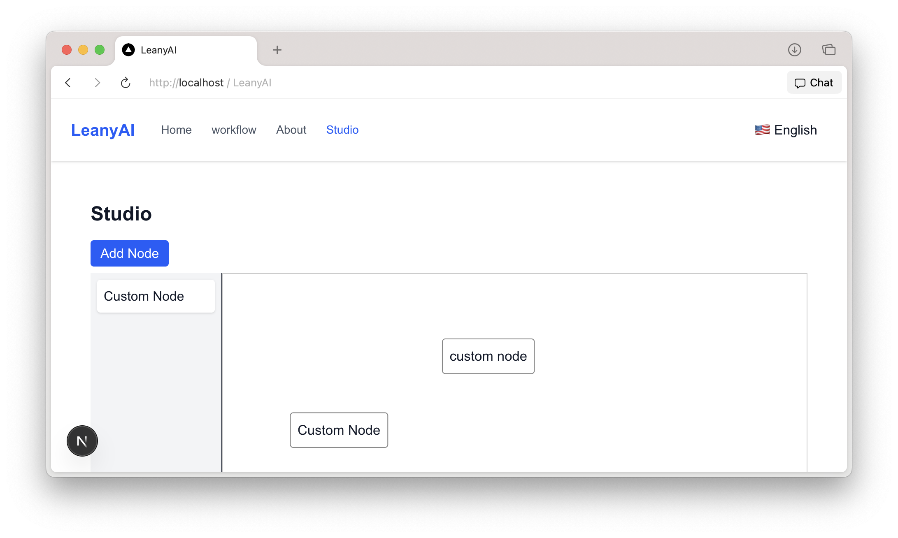

# LeanyAI
[](LICENSE)
[](https://hub.docker.com/r/YOUR_DOCKER_IMAGE)


[](https://react.dev/)
[](https://nextjs.org/)
[](https://fastapi.tiangolo.com/)
[](https://www.typescriptlang.org/)
[](https://pnpm.io/)
[](https://nginx.org/)
[](https://www.i18next.com/)

[](https://github.com/MouYongli/LeanyAI/actions/workflows/check-dev.yml)


## 项目概述 / Project Overview
LeanyAI 是一个基于 Next.js 和 FastAPI 的多语言 AI 平台，支持前后端分离部署，提供可扩展的工作流管理和 i18n 国际化功能。

## 目录 / Table of Contents
- [项目概述 / Project Overview](#项目概述--project-overview)
- [功能特性 / Features](#功能特性--features)
- [目录结构 / Directory Structure](#目录结构--directory-structure)
- [安装与启动 / Getting Started](#安装与启动--getting-started)
- [工具介绍 / Tooling](#工具介绍--tooling)


## 功能特性 / Features
- 多语言支持 (i18next、SSR)
- 前后端分离架构 (Next.js, FastAPI)
- 可定制工作流管理界面
- Docker & Nginx 一键部署

## 先决条件 / Prerequisites
- Node.js >= 18
- pnpm >= 7
- Docker & Docker Compose

## 目录结构 / Directory Structure
```text
top-level /
├── web/           # 前端 Next.js 应用，详见 web/README.md
├── api/           # 后端服务 (FastAPI, 包含 fastapi 和 minio 相关代码)
│   ├── main.py   # FastAPI 相关代码
│   └── Dockerfile.minio     # MinIO 集成与相关代码
├── docker/        # Compose + Nginx 部署配置
└── docs/          # 文档与设计资源
```

## 安装与启动 / Getting Started
1. 进入项目根目录并安装依赖：
   ```bash
   cd web && pnpm install
   ```
2. 启动开发模式：
   ```bash
   pnpm dev
   ```
3. 或使用 Docker 一键部署：
     ```bash
     cd docker
     docker-compose -f docker-compose.yml up -d --build
     ```

     访问 http://leany.warhol.informatik.rwth-aachen.de (http://localhost:8301)  
     通过 warhol 的 Nginx 统一入口访问前端/后端

## 工具介绍 / Tooling
- Repomix
   - difyCode.xml 由 Repomix 生成，可用于 AI 代码理解与分析。
   - Repomix 可将整个代码仓库打包成单个 AI 友好的文件，便于大模型理解。
   ```
   difyCode.xml   由 Repomix 生成的 AI 友好代码包
   ```

