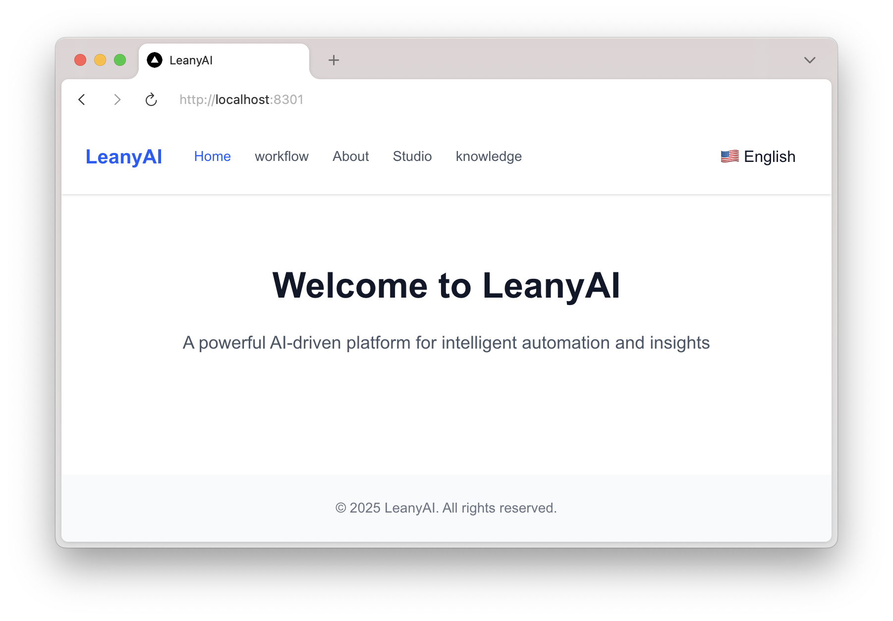

#  

<p align="center">
   <a href="LICENSE"></a>
   <a href="https://hub.docker.com/r/YOUR_DOCKER_IMAGE"></a>
</p>

<p align="center">
   <a href="https://react.dev/"></a>
   <a href="https://nextjs.org/"></a>
   <a href="https://fastapi.tiangolo.com/"></a>
   <a href="https://www.typescriptlang.org/"></a>
   <a href="https://pnpm.io/"></a>
   <a href="https://nginx.org/"></a>
   <a href="https://www.i18next.com/"></a>
   <a href="https://github.com/MouYongli/LeanyAI/actions/workflows/check-dev.yml"></a>
</p>


## 项目概述 / Project Overview
LeanyAI 是一个基于 Next.js 和 FastAPI 的多语言 AI 平台，支持前后端分离部署，提供可扩展的工作流管理和 i18n 国际化功能。

## 目录 / Table of Contents
- [项目概述 / Project Overview](#项目概述--project-overview)
- [目录结构 / Directory Structure](#项目结构--directory-structure)
- [功能特性 / Features](#功能特性--features)
- [先决条件 / Prerequisites](#先决条件--prerequisites)
- [安装与启动 / Getting Started](#安装与启动--getting-started)


## 项目结构 / Directory Structure
```text
/
├── web/                      # 前端 Next.js 应用，详见 web/README.md
...
│   └── readme.md             # 前端使用说明
├── api/                      # 后端服务 (FastAPI, 包含 fastapi 和 minio 相关代码)
│   ├── main.py               # FastAPI 相关代码
...
│   └── Dockerfile.minio      # MinIO 集成与相关代码
├── docker/
│   ├── docker-compose.yml    # Docker Compose 配置
│   └── readme.md             # Docker 使用说明
└── docs/                     # 文档与设计资源
```

## 先决条件 / Prerequisites
- Node.js >= 18
- pnpm >= 7
- Docker & Docker Compose


## 安装与启动 / Getting Started

### Docker 一键部署 / Docker Deployment
1. 进入 `docker` 目录并启动所有服务：
   ```bash
   cd docker
   docker-compose -f docker-compose.yml up -d --build
   ```
2. 通过浏览器访问统一入口：
   - http://localhost:8301 (或 http://leany.warhol.informatik.rwth-aachen.de)

### 本地开发 / Local Development
#### 前端 / Frontend
```bash
cd web
pnpm install
pnpm dev
```
- 访问: http://localhost:3000

#### 后端 / Backend
```bash
cd api
pip install -r requirements.txt
uvicorn main:app --reload --host 0.0.0.0 --port 8000
```
- 访问: http://localhost:8000/docs


## 功能特性 / Features
- 多语言支持 (i18next、SSR)
- 前后端分离架构 (Next.js, FastAPI)
- 可定制工作流管理界面
- Docker & Nginx 一键部署
