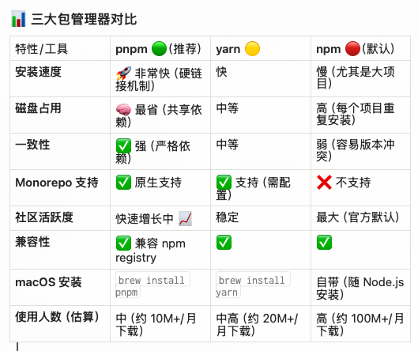
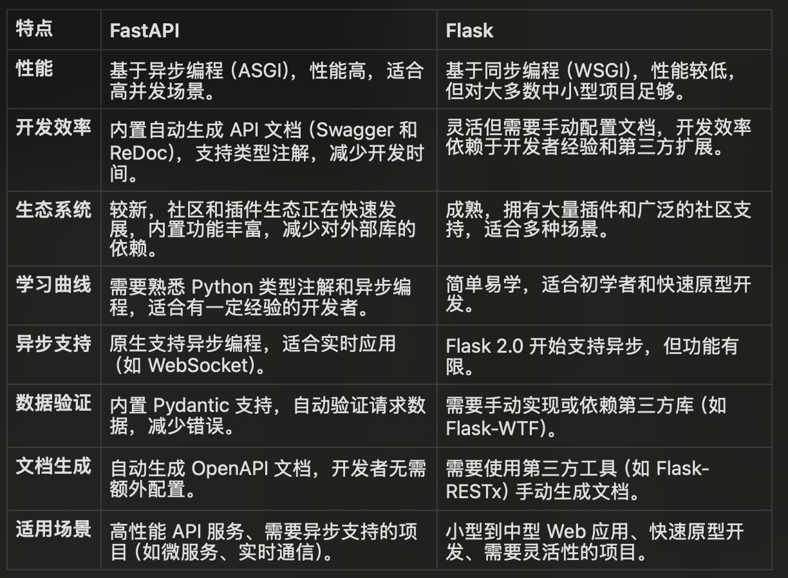
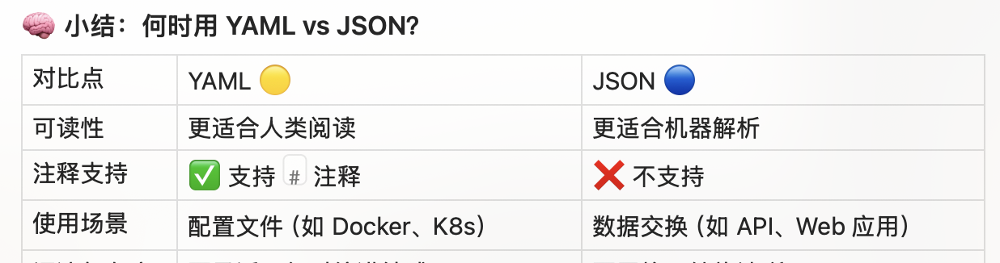
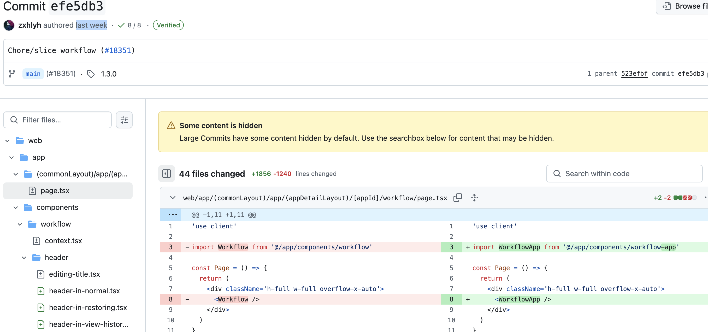

# pnpm

# fastAPI

# deploy docker compose 
1. without nginx
2. nginx available
3. with nginx

## Deployment methods

This project supports three different deployment methods using Docker Compose:

1. **Nginx direct deployment**:
   - Use the `docker-compose-nginx-direct.yml` file to deploy the project with Nginx as a reverse proxy.
   - Command: `docker-compose -f docker/docker-compose-nginx-direct.yml up --build`

2. **Mounting an existing Nginx**:
   - Use the `docker-compose-existing-nginx.yml` file to deploy the project with an existing Nginx instance.
   - Command: `docker-compose -f docker/docker-compose-existing-nginx.yml up --build`

3. **Without Nginx**:
   - Use the `docker-compose-no-nginx.yml` file to deploy the project without Nginx.
   - Command: `docker-compose -f docker/docker-compose-no-nginx.yml up --build`

# yaml vs json

# Dify 的核心理念和实现方式**正是**：

1.  **前端构建 Workflow**: 用户在 Dify 的 Web 界面上，通过拖拽、连接不同的节点（如 LLM、代码、知识库检索、工具调用等），并配置每个节点的参数，来**可视化地构建和定义**整个工作流程（Workflow）。这个过程的产物是一个描述了节点、连接关系和配置的数据结构（通常是 JSON 格式）。

2.  **后端 Workflow 执行引擎**: 当用户运行这个 Workflow（例如通过 API 调用或在 Dify 内部调试运行时）：
    * 后端服务接收到这个 Workflow 的定义（或其 ID）。
    * 后端有一个**核心的执行引擎（Orchestrator）**，负责解析这个 Workflow 定义。
    * 该引擎根据节点之间的**连接关系（Edges）**确定执行顺序和数据流向。
    * 对于流程中的每一个**节点（Node）**，引擎会根据其**类型（Type）**（如 `llm`, `code`, `knowledge_retrieval`, `http_request` 等），去调用后端相应的**执行器（Node Executor）**。
    * 每个**Node Executor**是后端的一段代码（一个函数、类或服务），专门负责执行该类型节点的具体逻辑（例如，调用 OpenAI API、在沙箱中运行 Python 代码、查询向量数据库、发送 HTTP 请求等），并处理其输入、输出和错误。
    * 执行引擎负责管理整个流程的状态，并将上一个节点的输出作为下一个节点的输入进行传递。

这种**前后端分离、模型驱动执行**的架构是 Dify（以及许多类似的 Low-code/No-code 和流程编排平台）的关键设计模式。它使得非程序员也能通过图形界面构建复杂的应用程序逻辑，而实际的计算和操作则由后端稳定、安全、可扩展的执行器来完成。

# workflow component in dify

现在用的是 workflow-app