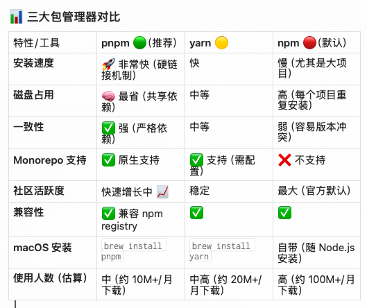
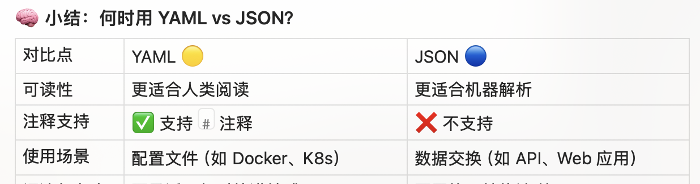

# pnpm


# fastAPI


# deploy docker compose 
1. without nginx
2. nginx available
3. with nginx

## Deployment methods

This project supports three different deployment methods using Docker Compose:

1. **Nginx direct deployment**:
   - Use the `docker-compose-nginx-direct.yml` file to deploy the project with Nginx as a reverse proxy.
   - Command: `docker-compose -f docker/docker-compose-nginx-direct.yml up --build`

2. **Mounting an existing Nginx**:
   - Use the `docker-compose-existing-nginx.yml` file to deploy the project with an existing Nginx instance.
   - Command: `docker-compose -f docker/docker-compose-existing-nginx.yml up --build`

3. **Without Nginx**:
   - Use the `docker-compose-no-nginx.yml` file to deploy the project without Nginx.
   - Command: `docker-compose -f docker/docker-compose-no-nginx.yml up --build`

# yaml vs json



# 工具介绍 / Tooling
- Repomix
   - difyCode.xml 由 Repomix 生成，可用于 AI 代码理解与分析。
   - Repomix 可将整个代码仓库打包成单个 AI 友好的文件，便于大模型理解。
   ```
   difyCode.xml   由 Repomix 生成的 AI 友好代码包
   ```

