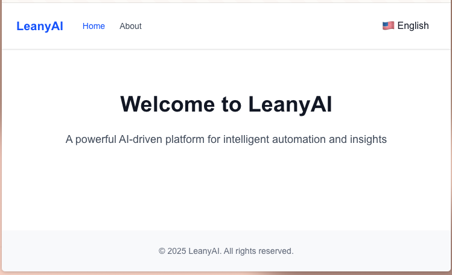

# Leany AI Frontend

LeanyAI 前端是一个基于 [Next.js](https://nextjs.org/) 的多语言 SSR 应用，支持 React 19、TypeScript、TailwindCSS 和 i18next 国际化。

## 技术栈
- Next.js 15
- React 19
- TypeScript 5
- TailwindCSS 4
- i18next + react-i18next（多语言）
- ESLint 9

## 主要特性
- 多语言支持（中/英/德）
- 服务器端渲染（SSR）
- 响应式设计，适配多端
- 主题切换（浅色/深色）
- 组件化开发，易于扩展

## 目录结构
- app/         —— 页面与布局（支持 SSR）
- components/  —— 公共组件（Header、Logo、Layout、i18n 等）
- i18n/        —— 国际化配置与多语言资源
- hooks/       —— 自定义 hooks（如 useI18n）
- public/      —— 静态资源

## 国际化说明
- 支持 en/zh/de 三种语言，默认英文
- 语言切换组件：`LanguageSwitcher`
- 语言配置：`i18n/config.ts`、`i18n/language.ts`
- 多语言资源：`i18n/en/common.ts`、`i18n/zh/common.ts`、`i18n/de/common.ts`
- SSR/CSR 统一国际化上下文，详见 `context/i18n-provider.tsx`

## 启动开发环境
```bash
npm install -g pnpm

pnpm install
pnpm run dev
```

## 构建与生产
```bash
pnpm run build
pnpm start
```

## Docker 部署
- 见根目录 docker/ 及 web/Dockerfile
- 推荐通过 docker-compose 统一编排

## 环境变量
- 支持 .env.local 配置
- 主要变量：PORT、NODE_ENV 等

## 页面截图



## 扩展说明
- 新增语言：在 i18n/ 下添加对应目录和 common.ts
- 新增页面/组件：按 Next.js 约定放入 app/ 或 components/

更多细节见根目录 README 及源码注释。


使用了 mui。