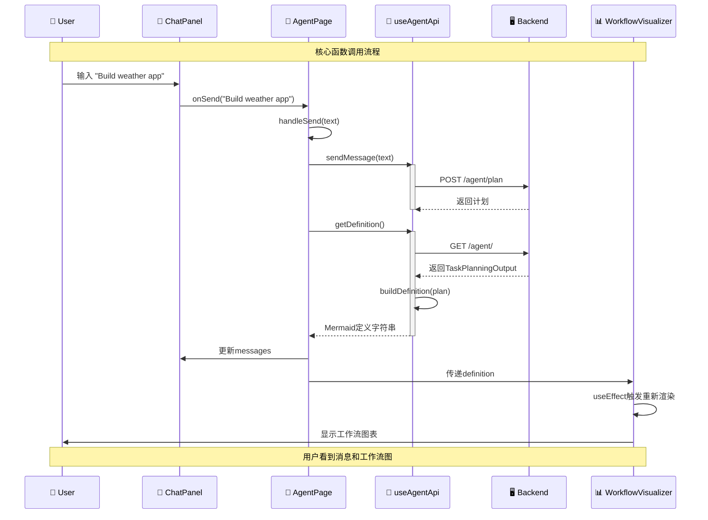

# Agent Page 数据流动序列图 (简化版)

这个序列图展示了从用户输入消息到后端处理并更新工作流图的核心函数调用。



## 核心函数调用

### 1. 消息传递链
```
用户输入 → ChatPanel.onSend() → AgentPage.handleSend() → useAgentApi.sendMessage()
```

### 2. API调用
```
POST /agent/plan  // 发送用户消息
GET /agent/       // 获取最新工作流
```

### 3. 数据转换
```
TaskPlanningOutput → AgentPlan → Mermaid字符串
```

### 4. 状态更新
```
setMessages() → setDefinition() → UI重新渲染
```
